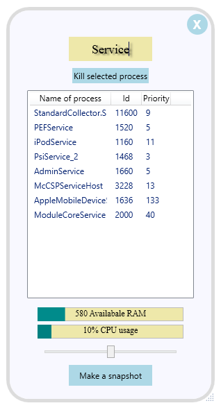

# TaskManager
This is a project I have created during ERASMUS exchange to Fachhochschule Vorarlberg (Austria) as a part of .Net Software Development course

Application is written on C# using WPF. It accesses "Diagnostics" class and shows a list of currently running processes. Application features are search and ending selected process.

Here is a screenshot:

  

